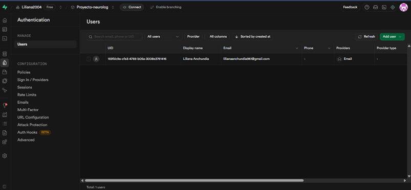
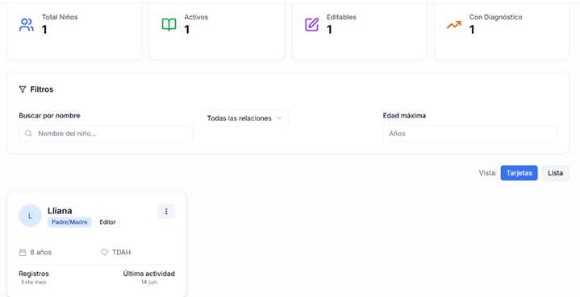
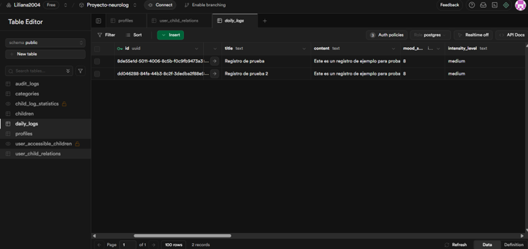
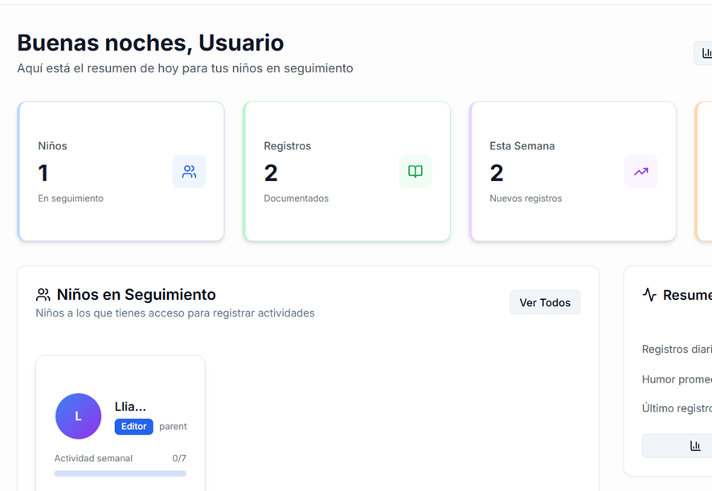

## 🔧 Configuración Local

### Requisitos Previos
- Node.js v18.0+
- npm v8.0+
- Cuenta Supabase

### Instalación
1. Clonar repositorio
2. Instalar dependencias: `npm install`
3. Configurar variables de entorno: copiar `.env.example` a `.env.local`
4. Ejecutar: `npm run dev`

### Variables de Entorno Requeridas
- `NEXT_PUBLIC_SUPABASE_URL`: URL de proyecto Supabase
- `NEXT_PUBLIC_SUPABASE_ANON_KEY`: Clave pública de Supabase

### Verificar en navegador:
Abre http://localhost:3000

### Probar funcionalidades:

Registro de usuario

Creación de perfil de niño

Registro de evento diario

Visualización de datos

